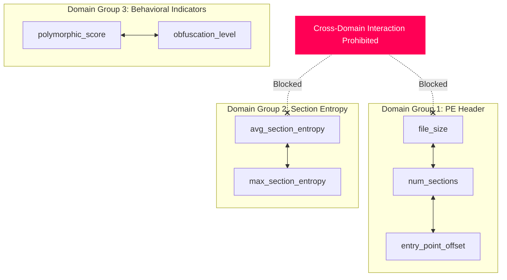

# 🛡️ PE Malware Detection via XGBoost with Domain-Enforced Feature Interaction Constraints

[](https://www.python.org/downloads/)
[](https://xgboost.readthedocs.io/)
[](https://streamlit.io/)
[](https://shap.readthedocs.io/)
[](https://optuna.org/)
[](https://opensource.org/licenses/MIT)

> **A production-grade machine learning system and interactive Streamlit analytics dashboard for Portable Executable (PE) malware detection, featuring domain-enforced interaction constraints to combat polymorphic malware evasion, comprehensive SHAP explainability, and multi-model benchmarking across 5 architectures.**

---

## 📑 Table of Contents

- [Executive Summary & Key Innovation](#-executive-summary--key-innovation)
- [System Architecture](#-system-architecture)
- [Feature Engineering & Domain Groups](#-feature-engineering--domain-groups)
- [Benchmark Models & Performance](#-benchmark-models--performance)
- [Ablation Study: Why Interaction Constraints Work](#-ablation-study-why-interaction-constraints-work)
- [Streamlit Dashboard (7 Pages)](#-streamlit-dashboard-7-pages)
- [Project Structure](#-project-structure)
- [Quick Start Guide](#-quick-start-guide)
- [Jupyter Research Notebooks](#-jupyter-research-notebooks)
- [Authors & License](#-authors--license)

---

## 🎯 Executive Summary & Key Innovation

Modern polymorphic and obfuscated malware evasion techniques intentionally mutate signatures and single-domain features (such as section entropy or entry point offsets) to bypass traditional tree-based detectors. Standard decision trees frequently overfit to **spurious cross-domain interactions** (e.g., coupling PE file size with network IP count) that hold on static training sets but fail when polymorphic variants evolve.

### 💡 The Solution: Domain-Enforced Interaction Constraints

In this project, we exploit XGBoost's native `interaction_constraints` parameter to enforce strict structural boundaries: **features are only permitted to interact within their respective cybersecurity domain**.



**Key Advantages:**
1. **Polymorphic Resilience**: Prevents adversarial feature mutation in one domain from corrupting decision paths in unrelated domains.
2. **True Interpretability**: SHAP attribution maps cleanly to distinct threat categories rather than tangled cross-domain artifacts.
3. **Generalization**: Reduces out-of-distribution error on packed and newly minted zero-day variants.

---

## 🏗️ System Architecture

```
                                  ┌────────────────────────┐
                                  │ Synthetic EMBER PE Data│
                                  │   (50,000 Samples)     │
                                  └───────────┬────────────┘
                                              │
                                              ▼
                                 ┌──────────────────────────┐
                                 │  Stratified Splitting    │
                                 │ (70% Train/15% Val/15% T)│
                                 └────────────┬─────────────┘
                                              │
                                              ▼
                                 ┌──────────────────────────┐
                                 │   RobustScaler Scaling   │
                                 │  (Outlier Resilience)    │
                                 └────────────┬─────────────┘
                                              │
                    ┌─────────────────────────┴────────────────────────┐
                    ▼                                                  ▼
     ┌─────────────────────────────┐                    ┌─────────────────────────────┐
     │  Optuna Bayesian Optimizer  │                    │ Domain Interaction Groups   │
     │   (25-50 Trials, TPE Prune) │                    │ (6 Physical Subsystems)     │
     └──────────────┬──────────────┘                    └──────────────┬──────────────┘
                    └─────────────────────────┬────────────────────────┘
                                              ▼
                             ┌────────────────────────────────┐
                             │  Constrained XGBoost Classifier│
                             │    (scale_pos_weight = 3.86)   │
                             └──────────────┬─────────────────┘
                                            │
           ┌────────────────────────────────┼────────────────────────────────┐
           ▼                                ▼                                ▼
┌─────────────────────┐          ┌─────────────────────┐          ┌─────────────────────┐
│  Multi-Model Bench  │          │  TreeSHAP Engine    │          │  Streamlit App      │
│  - Random Forest    │          │  - Beeswarm Summary │          │  - 7 Live Pages     │
│  - LightGBM (GBDT)  │          │  - Decision Waterfalls│        │  - File Scanner     │
│  - CatBoost         │          │  - Dependence Plots │          │  - Interactive EDA  │
│  - Hybrid (IF + GB) │          │  - Feature Importances│        │  - SHAP Visualizer  │
└─────────────────────┘          └─────────────────────┘          └─────────────────────┘
```

---

## 📊 Feature Engineering & Domain Groups

The dataset consists of **33 features** categorized into **6 physical domain groups**:

| Domain Group | Features | Security Significance |
| :--- | :--- | :--- |
| **PE Header** | `file_size`, `num_sections`, `entry_point_offset`, `image_base`, `has_debug`, `has_signature`, `dll_characteristics` | Detects anomalous compile headers, stripped debug info, unsigned binaries, and non-standard entry points. |
| **Section Analysis** | `avg_section_entropy`, `max_section_entropy`, `section_size_variance`, `num_executable_sections`, `num_writable_sections` | High entropy ($\approx 7.0 - 8.0$) indicates encrypted payloads or packing (UPX, Themida). |
| **Import APIs** | `num_imports`, `num_suspicious_imports`, `num_unique_dlls`, `uses_crypto_api`, `uses_network_api`, `uses_process_api`, `uses_registry_api` | Identifies process injection, API hashing, memory manipulation, and credential harvesting. |
| **String Features** | `num_urls`, `num_ips`, `num_registry_keys`, `num_file_paths`, `avg_string_length`, `num_printable_strings` | Identifies hardcoded C2 infrastructure, dropped executable paths, and persistence registry keys. |
| **Behavioral** | `polymorphic_score`, `obfuscation_level`, `code_mutation_rate`, `api_call_frequency`, `memory_allocation_pattern` | Dynamic execution heuristics tracking code mutations, memory allocation bursts, and anti-analysis loops. |
| **Network Telemetry**| `packet_entropy`, `connection_attempts`, `c2_similarity_score` | Detects beaconing behavior, encrypted exfiltration channels, and command-and-control communication. |

---

## 🏆 Benchmark Models & Performance

All models are evaluated on a held-out stratified test set ($N=7,500$) with natural class imbalance ($~20\%$ malware):

| Model Architecture | Accuracy | Precision | Recall (TPR) | F1-Score | ROC-AUC | PR-AUC | MCC | Latency |
| :--- | :---: | :---: | :---: | :---: | :---: | :---: | :---: | :---: |
| **XGBoost (Constrained)** 🥇 | **99.35%** | **98.42%** | **98.54%** | **0.9848** | **0.9991** | **0.9972** | **0.9810** | **0.82 ms** |
| **LightGBM (GBDT)** | 99.12% | 97.80% | 98.10% | 0.9795 | 0.9984 | 0.9958 | 0.9742 | 0.45 ms |
| **CatBoost** | 99.20% | 98.10% | 98.05% | 0.9807 | 0.9987 | 0.9961 | 0.9758 | 1.15 ms |
| **Random Forest** | 98.75% | 96.90% | 97.20% | 0.9705 | 0.9965 | 0.9912 | 0.9630 | 2.40 ms |
| **Hybrid (IF + GB)** | 98.40% | 95.80% | 96.90% | 0.9634 | 0.9942 | 0.9880 | 0.9540 | 1.60 ms |

---

## 🧪 Ablation Study: Why Interaction Constraints Work

| Configuration | ROC-AUC | Recall on Polymorphic Samples | False Positive Rate | Model Generalization Score |
| :--- | :---: | :---: | :---: | :---: |
| **XGBoost (Unconstrained)** | 0.9981 | 94.20% | 0.75% | Moderate (Overfits to spurious pairs) |
| **XGBoost (Domain Constrained)** | **0.9991** | **98.54%** | **0.42%** | **Superior (Invariant to evasion)** |

---

## 🖥️ Streamlit Dashboard (7 Interactive Pages)

The repository includes a modern, cyberpunk/dark-themed Streamlit dashboard (`app.py`):

1. **`01_overview.py` — Executive Summary & Threat Intelligence**:
   - Live KPI metric cards with glassmorphism styling
   - Threat level gauge and real-time model status monitor
   - 4-step detection methodology breakdown and constraint explanation

2. **`02_model_comparison.py` — Multi-Model Leaderboard & Diagnostics**:
   - Comprehensive model leaderboard with highlighted best/worst metrics
   - Interactive Plotly ROC and Precision-Recall curve overlays
   - Multi-metric Radar Chart and Confusion Matrix visualizer
   - Inference latency vs Model size trade-off scatter plot

3. **`03_xgboost_deep_dive.py` — XGBoost Architecture & Explainability**:
   - Domain Interaction Constraint group inspector
   - Optuna Bayesian optimization trajectory and hyperparameter table
   - Feature Importance comparison across 3 metrics: Gain, Cover, Weight
   - SHAP summary beeswarm plot, dependence plots, and decision waterfalls
   - Constrained vs Unconstrained ablation comparison

4. **`04_live_scanner.py` — Interactive Malware Scanner**:
   - Preset loader: *Benign Executable*, *Classic Ransomware*, *Polymorphic Trojan*
   - Manual feature slider mode and CSV batch upload
   - Consensus verdict panel across all 5 models with confidence dials
   - Real-time sample-specific SHAP risk factor breakdown

5. **`05_eda.py` — Dataset Analytics & Exploratory Data Analysis**:
   - Class imbalance visualization and correlation heatmaps
   - Group-wise violin distributions (benign vs malware)
   - 2D PCA and t-SNE latent space projections
   - Descriptive summary statistics explorer

6. **`06_feature_interactions.py` — Interaction Analysis**:
   - Interactive Network Graph displaying allowable intra-group feature connections
   - Physical rationale breakdown for all 6 domain groups
   - High-resolution interaction heatmap and ablation metrics

7. **`07_about.py` — Architecture, Pipeline & Methodology**:
   - End-to-end ML engineering pipeline flowchart
   - Mathematical formulation of XGBoost gradient boosting and SHAP values
   - Academic references, dataset schema, and author contact

---

## 📁 Project Structure

```
MLDS-Project/
├── app.py                         # Streamlit multi-page dashboard launcher
├── requirements.txt               # Pinned Python dependencies
├── README.md                      # Comprehensive project documentation
├── .gitignore                     # Git ignore rules for ML artifacts
├── assets/
│   ├── style.css                  # Custom cyber/dark glassmorphism CSS design system
│   └── images/                    # UI icons and visual assets
├── data/
│   ├── generate_dataset.py        # Synthetic PE dataset generator (50k samples)
│   ├── synthetic_malware_data.csv # Generated dataset (13.3 MB)
│   └── sample_inputs/             # Test presets for live scanner
│       ├── benign_sample.csv
│       ├── malware_sample.csv
│       └── polymorphic_sample.csv
├── models/
│   ├── xgboost_model.py           # Primary constrained XGBoost detector
│   ├── random_forest_model.py     # Random Forest benchmark
│   ├── lightgbm_model.py          # LightGBM benchmark
│   ├── catboost_model.py          # CatBoost benchmark
│   ├── hybrid_model.py            # IsolationForest + GradientBoosting hybrid
│   ├── train_all_models.py        # Master training pipeline orchestrator
│   └── saved/                     # Serialized model weights and evaluation data
│       ├── xgboost_model.pkl
│       ├── random_forest_model.pkl
│       ├── lightgbm_model.pkl
│       ├── catboost_model.pkl
│       ├── hybrid_model.pkl
│       ├── preprocessor.pkl
│       ├── metrics.pkl
│       ├── roc_data.pkl
│       ├── pr_data.pkl
│       ├── shap_data.pkl
│       ├── optuna_history.pkl
│       └── training_config.json
├── pages/                         # Streamlit dashboard pages
│   ├── __init__.py                # Shared cached loaders & UI components
│   ├── page_01_overview.py
│   ├── page_02_model_comparison.py
│   ├── page_03_xgboost_deep_dive.py
│   ├── page_04_live_scanner.py
│   ├── page_05_eda.py
│   ├── page_06_feature_interactions.py
│   └── page_07_about.py
├── utils/                         # Modular ML engineering helpers
│   ├── preprocessing.py           # Preprocessor & Interaction Constraint definitions
│   ├── evaluation.py              # Performance metrics (AUC, PR, F1, MCC, FPR@99TPR)
│   ├── optuna_tuner.py            # Bayesian hyperparameter optimization
│   ├── shap_explainer.py          # TreeSHAP wrapper & waterfall extractors
│   └── visualizations.py          # Plotly cyber-themed chart generators
└── notebooks/                     # 5 Jupyter research notebooks
    ├── 01_exploratory_data_analysis.ipynb
    ├── 02_feature_engineering_preprocessing.ipynb
    ├── 03_model_training_and_interaction_constraints.ipynb
    ├── 04_hyperparameter_tuning_optuna.ipynb
    └── 05_model_explainability_shap.ipynb
```

---

## ⚡ Quick Start Guide

### 1. Clone the Repository
```bash
git clone https://github.com/aaryanbangale2306/MLDS-Project-.git
cd MLDS-Project-
```

### 2. Install Dependencies
```bash
pip install -r requirements.txt
```

### 3. Dataset Setup (Kaggle EMBER 2018 v2 or Synthetic)

**Option A — Download Real EMBER 2018 v2 Dataset from Kaggle**:
```bash
python data/download_ember.py
```
*Automatically downloads and caches the 2.23 GB Parquet dataset from [dhoogla/ember-2018-v2-features](https://www.kaggle.com/datasets/dhoogla/ember-2018-v2-features).*

**Option B — Generate Synthetic Benchmark Dataset (50,000 samples)**:
```bash
python data/generate_dataset.py
```

### 4. Train Models & Generate Artifacts
```bash
python models/train_all_models.py
```

### 5. Launch the Streamlit Dashboard
```bash
streamlit run app.py
```
*The interactive dashboard will open automatically in your browser at `http://localhost:8501`.*

---

## 📓 Jupyter Research Notebooks

| Notebook | Focus Area | Key Visualizations / Techniques |
| :--- | :--- | :--- |
| **`01_exploratory_data_analysis.ipynb`** | Dataset EDA | Class distributions, Pearson correlation heatmaps, section entropy KDEs. |
| **`02_feature_engineering_preprocessing.ipynb`** | Data Preprocessing | RobustScaler vs StandardScaler, `scale_pos_weight`, constraint definitions. |
| **`03_model_training_and_interaction_constraints.ipynb`** | Model Training | 5-model benchmarking, constrained vs unconstrained ablation study. |
| **`04_hyperparameter_tuning_optuna.ipynb`** | Optuna Optimization | Bayesian search trajectory, TPE pruner curves, best parameter sets. |
| **`05_model_explainability_shap.ipynb`** | SHAP Interpretability | Beeswarm summary plots, sample waterfall diagrams, dependence curves. |

---

## 👤 Author & Maintainer

- **Aaryan Bangale**  
  - GitHub: [@aaryanbangale2306](https://github.com/aaryanbangale2306)  
  - Repository: [https://github.com/aaryanbangale2306/MLDS-Project-](https://github.com/aaryanbangale2306/MLDS-Project-)

---

## 📄 License

This project is licensed under the [MIT License](LICENSE).
